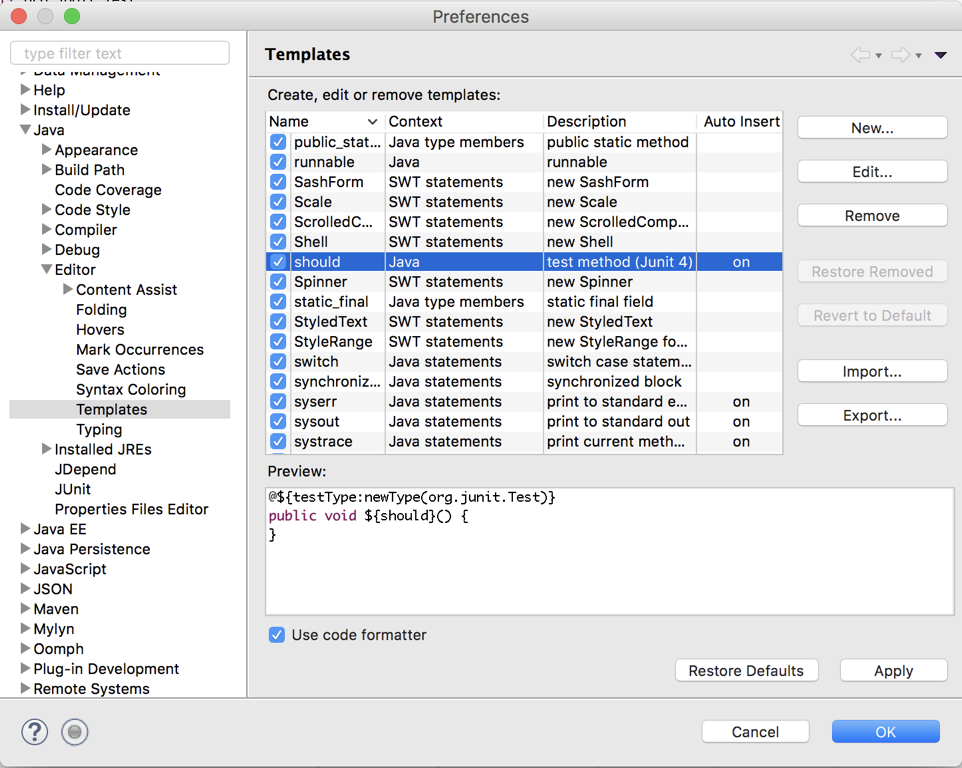
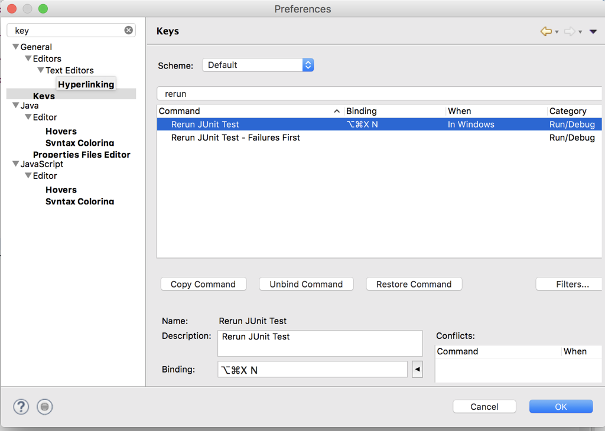
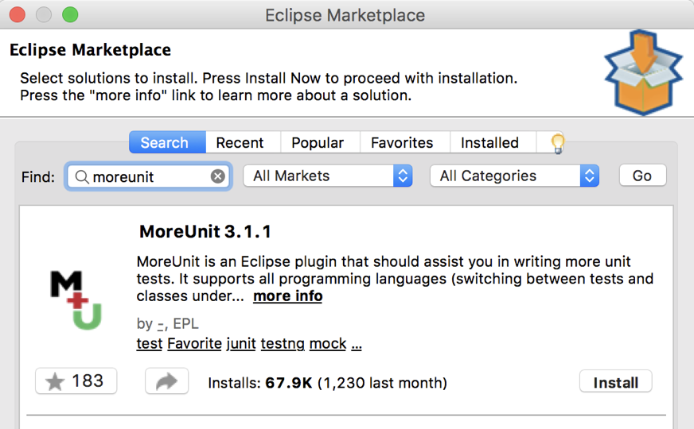

# Eclipse Tips for TDD

## Use AssertJ
I prefer AssertJ:s fluent ``assertThat(expectaction).is(actual)`` over ``assertEquals(expectation, is(actual))`.
* AssertJ supports chaining, ie ``assertThat(expectaction).hasSize(9).startswith("start")``
* Supports Java 8 exception assertions with ``assertThatThrownBy(() -> { throw new Exception("thrown!"); }).hasMessage("message");``
* Has excellent collection support: ``assertThat(list).contains(item1, item2)``
* Try it! <http://joel-costigliola.github.io/assertj/assertj-core-quick-start.html>

## Create your own Editor Template
I prefer should as test prefix, for example AdressTest::shouldHaveZip reads better than AdressTest::testThatHaveZip
By creating my own Editor Template I can have it my way:

  

## Add used libraries to Favorites
I typically use AssertJ and Mockito a lot. To make content assist always recognize when I type assertThat or verify I add them to Favorites:

  

## Add a Rerun JUnit Test Key Binding
I often end up writing the test, jumping to the implementation, and wanting to run the test from the implementation. Guess what, you can!

## Use MoreUnit
My main reason for using MoreUnit is that it adds Ctrl-J as a keyboard shortcut for jumping between your test and implementation, or if not there jumps to create class for you. It has other features as well!

